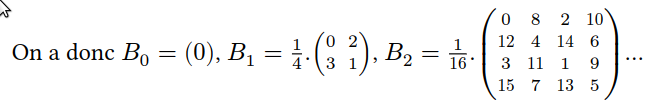

# Ditherpunk: retour au monochrome

LAVENANT Jordan - RIBEROU Kylian - BUT 3

# Pré-requis

> Traitement 1, 2, 3, 4 **OBLIGATOIRE**

> Faire les traitements 5, 6, 7 **pour améliorer la note**

> Librairie **ARGH**: les triples `/` permettent de guider l'utilisateur à utiliser l'application en CLI (grâce à la commande cargo run -- --help)

# Lancement

Build

```bash
cargo build
```

Importer une image

```bash
# Importer une image avec le mode seuil
cargo run -- ./imports/test.jpg seuil
```

```bash
# Importer une image avec le mode palette (fournir l'argument supplémentaire)
cargo run -- ./imports/test.jpg palette --n-couleurs 5
```

# Questions

## Question 2

- Pour ouvrir une image depuis un fichier, on utilise :

```bash
cargo run -- ./imports/test.jpg
```

- On obtient un DynamicImage, à quoi correspond ce type?

- Comment obtenir une image en mode rbg8

Une image arbitraire peut avoir des pixels de nature différente:

- avec un nombre variables de canaux (couleurs ou non, transparence ou non)
- avec un type de donnée différent pour les canaux (entiers sur un octet, flottants ou autres)
  Passer l’image d’entrée en mode rgb8, c’est-à-dire avec 3 canaux R, G, B, représentés chacun
  par un u8.

## Question 3

_Sauver l’image obtenue au format png. Que se passe-t-il si l’image de départ avait un canal
alpha?_

## Question 4

_Afficher dans le terminal la couleur du pixel (32,52) de l’image de votre choix._

## Question 5

_Passer un pixel sur deux d’une image en blanc. Est-ce que l’image obtenue est reconnaissable?_

## Question 6

_Comment récupérer la luminosité d’un pixel?_

## Question 9

_Comment calculer la distance entre deux couleurs? Indiquer dans le README la méthode de
calcul choisie._

## Question 11

_Votre application doit se comporter correctement si on donne une palette vide. Vous
expliquerez dans votre README le choix que vous avez fait dans ce cas._

## Question 13



_Déterminer 𝐵3._

## Question 17

_Pour une palette de couleurs comme dans la partie 3, expliquer dans votre README comment
vous représentez l’erreur commise à chaque pixel, comment vous la diffusez._
