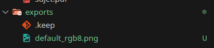
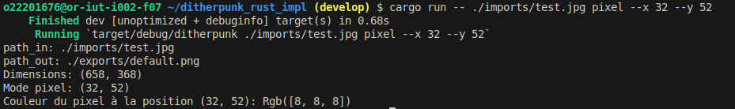

# Ditherpunk: retour au monochrome

LAVENANT Jordan - RIBEROU Kylian - BUT 3

# Pré-requis

> Traitement 1, 2, 3, 4 **OBLIGATOIRE**

> Faire les traitements 5, 6, 7 **pour améliorer la note**

> Librairie **ARGH**: les triples `/` permettent de guider l'utilisateur à utiliser l'application en CLI (grâce à la commande cargo run -- --help)

# Lancement

Build

```bash
cargo build
```

Importer une image

```bash
# Importer une image avec le mode seuil
cargo run -- ./imports/test.jpg seuil
```

```bash
# Importer une image avec le mode palette (fournir l'argument supplémentaire)
cargo run -- ./imports/test.jpg palette --n-couleurs 5
```

# Questions

## Question 2

- Pour ouvrir une image depuis un fichier, on utilise :

```bash
cargo run -- ./imports/test.jpg
```

- On obtient un DynamicImage, à quoi correspond ce type?

DynamicImage est un type de la bibliothèque Rust image, conçu pour gérer des images de formats variés (RGB, RGBA, Luma, etc.) et de types de données différents (entiers, flottants, etc.). Il simplifie la manipulation d'images en abstrahant leur format interne.

- Comment obtenir une image en mode rbg8

Pour convertir une image en mode `Rgb8` (3 canaux R, G, B, chacun représenté par un `u8`), utilisez la méthode `to_rgb8()` de `DynamicImage`.

```rust
// Lire l'image
let img: DynamicImage = ImageReader::open(path_in)?.decode()?;
let img_rgb8 = img.to_rgb8();
```

Une image arbitraire peut avoir des pixels de nature différente:

- avec un nombre variables de canaux (couleurs ou non, transparence ou non)
- avec un type de donnée différent pour les canaux (entiers sur un octet, flottants ou autres)
  Passer l’image d’entrée en mode rgb8, c’est-à-dire avec 3 canaux R, G, B, représentés chacun
  par un u8.

## Question 3

_Sauver l’image obtenue au format png._

```rust
let args: DitherArgs = argh::from_env();
let path_in = args.input;
let path_out = args.output.unwrap_or("./exports/default.png".to_string());

// Lire l'image
let img: DynamicImage = ImageReader::open(path_in)?.decode()?;
let img_rgb8 = img.to_rgb8();

// Sauvegarder l'image en mode Rgb8
let rgb8_path = format!("{}_rgb8.png", path_out.trim_end_matches(".png"));
img_rgb8.save(&rgb8_path)?;
```

Exportation de l'image : 



_Que se passe-t-il si l’image de départ avait un canal
alpha?_

Si l'image de départ avait un canal alpha, la méthode `to_rgb8()` de `DynamicImage` supprime le canal alpha et ne conserve que les canaux R, G, B.

## Question 4

_Afficher dans le terminal la couleur du pixel (32,52) de l’image de votre choix._

Pour cette question, nous avons créer un nouveau mode de traitement `pixel`, prenant des sous-paramètres `x` et `y` pour déterminer les coordonnées du pixel à afficher.

```rust
#[derive(Debug, Clone, PartialEq, FromArgs)]
#[argh(subcommand)]
enum Mode {
    Seuil(OptsSeuil),
    Palette(OptsPalette),
    Pixel(OptsPixel),
}

#[derive(Debug, Clone, PartialEq, FromArgs)]
#[argh(subcommand, name = "pixel")]
/// Affiche la couleur du pixel à la position (x, y)
struct OptsPixel {
    #[argh(option, description = "coordonnées x du pixel")]
    x: usize,
    #[argh(option, description = "coordonnées y du pixel")]
    y: usize,
}
```

```rust
match mode {
    Mode::Seuil(_) => {
        println!("Mode seuil");
    }
    Mode::Palette(opts) => {
        println!("Mode palette: {:?}", opts.n_couleurs);
    }
    Mode::Pixel(opts) => {
        println!("Mode pixel: ({}, {})", opts.x, opts.y);
        println!("Pixel: {:?}", img.get_pixel(opts.x as u32, opts.y as u32));
    }
}
```

Affichage de la couleur du pixel (32, 52) :




## Question 5

_Passer un pixel sur deux d’une image en blanc. Est-ce que l’image obtenue est reconnaissable?_

## Question 6

_Comment récupérer la luminosité d’un pixel?_

## Question 9

_Comment calculer la distance entre deux couleurs? Indiquer dans le README la méthode de
calcul choisie._

## Question 11

_Votre application doit se comporter correctement si on donne une palette vide. Vous
expliquerez dans votre README le choix que vous avez fait dans ce cas._

## Question 13


_Déterminer 𝐵3._

## Question 17

_Pour une palette de couleurs comme dans la partie 3, expliquer dans votre README comment
vous représentez l’erreur commise à chaque pixel, comment vous la diffusez._
