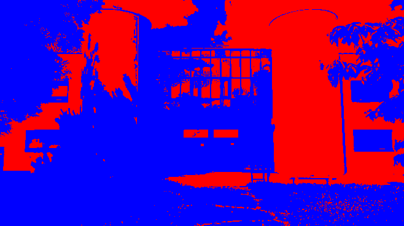
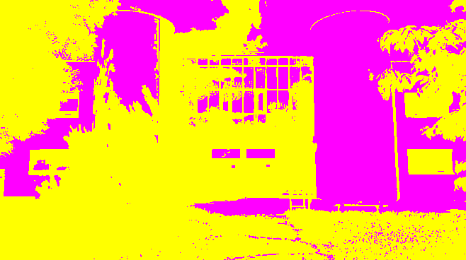
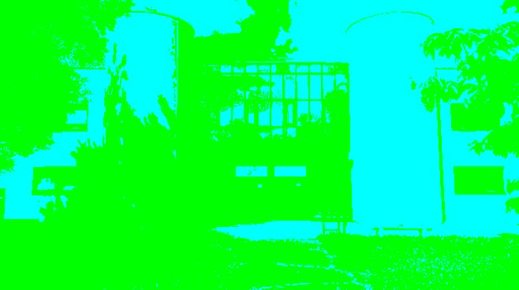
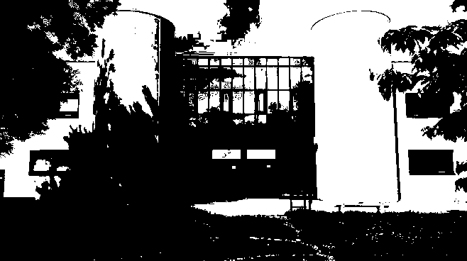
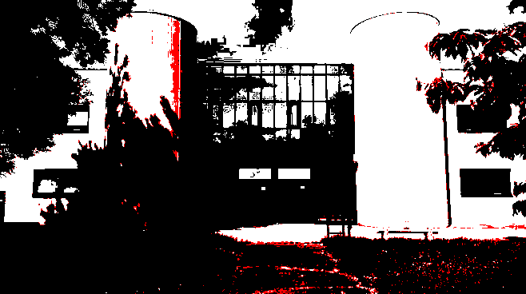

# Ditherpunk: retour au monochrome

LAVENANT Jordan - RIBEROU Kylian - BUT 3

# Pré-requis

> Traitement 1, 2, 3, 4 **OBLIGATOIRE**

> Faire les traitements 5, 6, 7 **pour améliorer la note**

> Librairie **ARGH**: les triples `/` permettent de guider l'utilisateur à utiliser l'application en CLI (grâce à la commande cargo run -- --help)

# Lancement

Build

```bash
cargo build
```

Importer une image

```bash
# Importer une image avec le mode seuil
cargo run -- ./imports/test.jpg seuil
```

```bash
# Importer une image avec le mode palette (fournir l'argument supplémentaire)
cargo run -- ./imports/test.jpg palette --n-couleurs 5
```

# Questions

## Question 1

Création d'un nouveau projet Cargo :
```toml
[package]
name = "ditherpunk"
version = "0.1.0"
edition = "2021"

# See more keys and their definitions at https://doc.rust-lang.org/cargo/reference/manifest.html

[dependencies]
image = "0.24.9"
argh = "0.1.13"
```

## Question 2

- Pour ouvrir une image depuis un fichier, on utilise :

```bash
cargo run -- ./imports/test.jpg
```

- On obtient un DynamicImage, à quoi correspond ce type?

DynamicImage est un type de la bibliothèque Rust image, conçu pour gérer des images de formats variés (RGB, RGBA, Luma, etc.) et de types de données différents (entiers, flottants, etc.). Il simplifie la manipulation d'images en abstrahant leur format interne.

- Comment obtenir une image en mode rbg8

Pour convertir une image en mode `Rgb8` (3 canaux R, G, B, chacun représenté par un `u8`), utilisez la méthode `to_rgb8()` de `DynamicImage`.

```rust
// Lire l'image
let img: DynamicImage = ImageReader::open(path_in)?.decode()?;
let img_rgb8 = img.to_rgb8();
```

Une image arbitraire peut avoir des pixels de nature différente:

- avec un nombre variables de canaux (couleurs ou non, transparence ou non)
- avec un type de donnée différent pour les canaux (entiers sur un octet, flottants ou autres)
  Passer l’image d’entrée en mode rgb8, c’est-à-dire avec 3 canaux R, G, B, représentés chacun
  par un u8.

## Question 3

_Sauver l’image obtenue au format png._

```rust
let args: DitherArgs = argh::from_env();
let path_in = args.input;
let path_out = args.output.unwrap_or("./exports/default.png".to_string());

// Lire l'image
let img: DynamicImage = ImageReader::open(path_in)?.decode()?;
let img_rgb8 = img.to_rgb8();

// Sauvegarder l'image en mode Rgb8
let rgb8_path = format!("{}_rgb8.png", path_out.trim_end_matches(".png"));
img_rgb8.save(&rgb8_path)?;
```

Exportation de l'image : 


_Que se passe-t-il si l’image de départ avait un canal
alpha?_

Si l'image de départ avait un canal alpha, la méthode `to_rgb8()` de `DynamicImage` supprime le canal alpha et ne conserve que les canaux R, G, B.

## Question 4

_Afficher dans le terminal la couleur du pixel (32,52) de l’image de votre choix._

Pour cette question, nous avons créer un nouveau mode de traitement `pixel`, prenant des sous-paramètres `x` et `y` pour déterminer les coordonnées du pixel à afficher.

```rust
#[derive(Debug, Clone, PartialEq, FromArgs)]
#[argh(subcommand)]
enum Mode {
    Seuil(OptsSeuil),
    Palette(OptsPalette),
    Pixel(OptsPixel),
}

#[derive(Debug, Clone, PartialEq, FromArgs)]
#[argh(subcommand, name = "pixel")]
/// Affiche la couleur du pixel à la position (x, y)
struct OptsPixel {
    #[argh(option, description = "coordonnées x du pixel")]
    x: usize,
    #[argh(option, description = "coordonnées y du pixel")]
    y: usize,
}
```

Fonction de récupération de la couleur du pixel :

```rust
fn get_pixel(img: &DynamicImage, x: u32, y: u32) -> image::Rgb<u8> {
    let pixel = img.get_pixel(x, y);
    let channels = pixel.channels();
    image::Rgb([channels[0], channels[1], channels[2]])
}

fn main() -> Result<(), ImageError> {
    let args: DitherArgs = argh::from_env();
    let path_in = args.input;
    let path_out = args.output.unwrap_or("./exports/default.png".to_string());
    let mode = args.mode;

    println!("path_in: {}", path_in);
    println!("path_out: {}", path_out);

    // Lire l'image
    let img: DynamicImage = ImageReader::open(path_in)?.decode()?;
    println!("Dimensions: {:?}", img.dimensions());

    match mode {
        Mode::Seuil(_) => {
            println!("Mode seuil");
        }
        Mode::Palette(opts) => {
            println!("Mode palette: {:?}", opts.n_couleurs);
        }
        Mode::Pixel(opts) => {
            println!("Mode pixel: ({}, {})", opts.x, opts.y);
            let pixel_color = get_pixel(&img, opts.x as u32, opts.y as u32);
            println!(
                "Couleur du pixel à la position ({}, {}): {:?}",
                opts.x, opts.y, pixel_color
            );
        }
    }

    Ok(())
}
```

Instructions pour afficher la couleur du pixel (32, 52) :

```bash
cargo run -- ./imports/test.jpg pixel --x 32 --y 52
```

Affichage de la couleur du pixel (32, 52) :


## Question 5

_Passer un pixel sur deux d’une image en blanc. Est-ce que l’image obtenue est reconnaissable?_

Traitement : 

```rust
fn traitement_split_white(img: &DynamicImage, path_out: String) -> Result<(), ImageError> {
    let (width, height) = img.dimensions();
    let mut img_out: RgbImage = ImageBuffer::new(width, height);

    for y in 0..height {
        for x in 0..width {
            if (x + y) % 2 == 0 {
                img_out.put_pixel(x, y, image::Rgb([255, 255, 255]));
            } else {
                img_out.put_pixel(x, y, img.get_pixel(x, y).to_rgb());
            }
        }
    }

    let img_out = DynamicImage::ImageRgb8(img_out);
    save(&img_out, path_out)
}
```

Instructions pour passer un pixel sur deux en blanc :

```bash
cargo run -- ./imports/test.jpg ./exports/split_white.png split_white
```

Résultat de l'image obtenue :


## Question 6

_Comment récupérer la luminosité d’un pixel?_

D'après la formule de luminance, la luminosité d'un pixel peut être calculée en multipliant les valeurs des canaux R, G, B par des coefficients de pondération reflétant la sensibilité de l'œil humain à ces couleurs. La luminosité est ensuite obtenue en sommant ces valeurs pondérées.

Rouge : `0.2126`  
Vert : `0.7152`  
Bleu : `0.0722`  

```rust
fn get_light(pixel: image::Rgb<u8>) -> u8 {
    let channels = pixel.channels();
    let light = 0.2126 * channels[0] as f32 + 0.7152 * channels[1] as f32 + 0.0722 * channels[2] as f32;
    light as u8
}
```

Ainsi, la luminosité d'un pixel est une valeur entre 0 et 255, où 0 représente le noir et 255 le blanc.

## Question 7

_Implémenter le traitement_

Traitement : 

```rust
fn traitement_monochrome(img: &DynamicImage, path_out: String) -> Result<(), ImageError> {
    let (width, height) = img.dimensions();
    let mut img_out: RgbImage = ImageBuffer::new(width, height);

    for y in 0..height {
        for x in 0..width {
            let pixel = img.get_pixel(x, y).to_rgb();
            let light = get_light(pixel);
            let new_pixel = if light > 127 {
                image::Rgb([255, 255, 255])
            } else {
                image::Rgb([0, 0, 0])
            };
            img_out.put_pixel(x, y, new_pixel);
        }
    }

    let img_out = DynamicImage::ImageRgb8(img_out);
    save(&img_out, path_out)
}
```
Instructions pour passer une image en monochrome selon la luminosité de ses pixels :

```bash
cargo run -- ./imports/test.jpg ./exports/monochrome.png seuil
```

Résultat de l'image obtenue :


## Question 8

Traitement permettant de passer une paire (2) de couleur à une image, en fonction de sa luminosité :

```rust
#[derive(Debug, Clone, PartialEq, FromArgs)]
#[argh(subcommand, name = "couleurs")]
/// Rendu de l’image par seuillage avec des couleurs personnalisées.
struct OptsCouleurs {
    /// la première couleur (format: 'red' / 'grey' / 'blue' / 'green' / 'yellow' / 'magenta' / 'cyan')
    #[argh(option)]
    couleur1: String,

    /// la seconde couleur (format: 'red' / 'grey' / 'blue' / 'green' / 'yellow' / 'magenta' / 'cyan')
    #[argh(option)]
    couleur2: String,
}
```

```rust
fn traitement_paire_palette(img: &DynamicImage, path_out: String, couleur1: String, couleur2: String) -> Result<(), ImageError> {
    let (width, height) = img.dimensions();
    let mut img_out: RgbImage = ImageBuffer::new(width, height);

    let couleur1 = match couleur1.as_str() {
        "white" => WHITE,
        "grey" => GREY,
        "black" => BLACK,
        "blue" => BLUE,
        "red" => RED,
        "green" => GREEN,
        "yellow" => YELLOW,
        "magenta" => MAGENTA,
        "cyan" => CYAN,
        _ => WHITE,
    };

    let couleur2 = match couleur2.as_str() {
        "white" => WHITE,
        "grey" => GREY,
        "black" => BLACK,
        "blue" => BLUE,
        "red" => RED,
        "green" => GREEN,
        "yellow" => YELLOW,
        "magenta" => MAGENTA,
        "cyan" => CYAN,
        _ => WHITE,
    };

    for y in 0..height {
        for x in 0..width {
            let pixel = img.get_pixel(x, y).to_rgb();
            let light = get_light(pixel);
            let new_pixel = if light > 127 {
                couleur1
            } else {
                couleur2
            };
            img_out.put_pixel(x, y, new_pixel);
        }
    }

    let img_out = DynamicImage::ImageRgb8(img_out);
    save(&img_out, path_out)
}
```

Instructions pour passer une paire de palette de couleurs à une image, en fonction de sa luminosité : 

```bash
cargo run -- ./imports/test.jpg ./exports/red_blue.png couleurs --couleur1 red --couleur2 blue
```

Résultat de l'image obtenue :

> Red / Blue


```bash
cargo run -- ./imports/test.jpg ./exports/magenta_yellow.png couleurs --couleur1 magenta --couleur2 yellow
```

> Magenta / Yellow


```bash
cargo run -- ./imports/test.jpg ./exports/cyan_green.png couleurs --couleur1 cyan --couleur2 green
```

> Cyan / Green



## Question 9

_Comment calculer la distance entre deux couleurs? Indiquer dans le README la méthode de
calcul choisie._

Pour calculer la distance entre deux couleurs, on peut utiliser la distance euclidienne. On peut donc sommer la distance entre chaque attributs R, G, et B, étant des nombres compris entre 0 et 255. On compare ensuite la distance entre chaque attribut de chaque couleur, puis nous conservons la distance la plus courte, et ainsi la couleur la plus proche.

```rust
fn get_closest_color(pixel: image::Rgb<u8>) -> image::Rgb<u8> {
    // Check if the pixel is already in the palette to early return
    if let Some(&color) = COLORS.iter().find(|&&c| c == pixel) {
        return color;
    }

    let mut min_distance = f32::MAX;
    let mut closest_color = COLORS[0];

    for color in COLORS.iter() {
        let distance = ((color[0] as f32 - pixel[0] as f32).powi(2)
            + (color[1] as f32 - pixel[1] as f32).powi(2)
            + (color[2] as f32 - pixel[2] as f32).powi(2))
        .sqrt();

        if distance < min_distance {
            min_distance = distance;
            closest_color = *color;
        }
    }

    closest_color
}
```

> On peut ensuite optimiser cette fonction en vérifiant si le pixel passé en paramètre est directement dans la palette, pour éviter de parcourir la palette entière à chaque fois.

## Question 10

_Implémenter le traitement_

Traitement : 

```rust
fn traitement_palette(img: &DynamicImage, path_out: String, _n_couleurs: usize) -> Result<(), ImageError> {
    // take the _n_couleurs first colors of the COLORS array and create a new array, and then replace all pixels by the closest color in the new array
    let (width, height) = img.dimensions();
    let mut img_out: RgbImage = ImageBuffer::new(width, height);
    let colors: Vec<image::Rgb<u8>> = COLORS.iter().take(_n_couleurs).cloned().collect();

    for y in 0..height {
        for x in 0..width {
            let pixel = img.get_pixel(x, y).to_rgb();
            let new_pixel = get_closest_color(pixel, &colors);
            img_out.put_pixel(x, y, new_pixel);
        }
    }

    let img_out = DynamicImage::ImageRgb8(img_out);
    save(&img_out, path_out)
}
```

Instructions pour passer une image en palette de couleurs :

```bash
cargo run -- ./imports/test.jpg ./exports/palette.png palette --n-couleurs 3
```

(2 couleurs)



(3 couleurs)



(8 couleurs)


## Question 11

_Votre application doit se comporter correctement si on donne une palette vide. Vous
expliquerez dans votre README le choix que vous avez fait dans ce cas._

## Question 12

_Implémenter le tramage aléatoire des images._

## Question 13


_Déterminer 𝐵3._

## Question 17

_Pour une palette de couleurs comme dans la partie 3, expliquer dans votre README comment
vous représentez l’erreur commise à chaque pixel, comment vous la diffusez._

